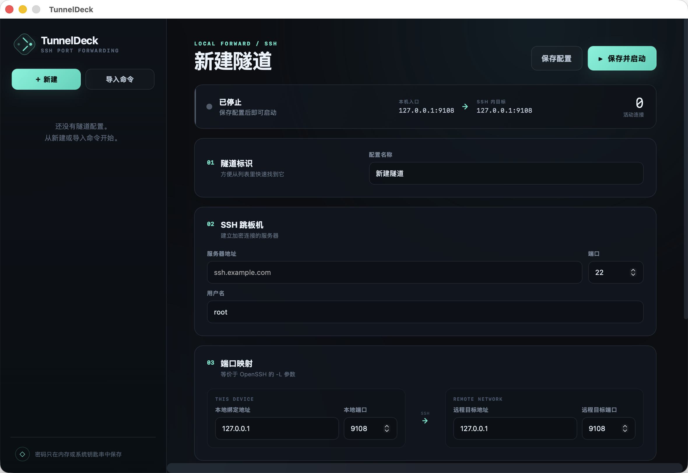

# TunnelDeck

[](https://github.com/Nciae-Zyh/TunnelDeck/actions/workflows/ci.yml)
[](https://github.com/Nciae-Zyh/TunnelDeck/actions/workflows/release.yml)
[](LICENSE)

一个轻量、跨平台的 SSH 本地端口转发 GUI。它把下面这类命令变成可保存、可快速启停的隧道配置：

```bash
ssh -L 9108:127.0.0.1:9108 -p 33899 root@ssh.example.com
```



## 功能

- 管理多个本地转发配置，显示运行状态和活动连接数
- 直接粘贴并解析安全范围内的 `ssh -L` 命令
- 密码认证、SSH 私钥认证、加密私钥口令
- 密码默认不保存；勾选“记住凭据”后写入系统安全存储
- 首次连接显示 SHA256 主机指纹，确认后写入应用独立的 `known_hosts`
- 服务器主机密钥变化时阻止连接，避免静默接受中间人攻击
- SSH keepalive、断线自动重连和 2–30 秒指数退避
- 默认只监听 `127.0.0.1`；主动绑定 `0.0.0.0` 或 `::` 时显示暴露风险提示
- 可将 HTTP/HTTPS 隧道标记为网页服务，连接后由用户主动点击打开
- Chrome 侧边栏扩展，共用桌面端配置和系统钥匙串
- macOS Apple Silicon、Windows AMD64、Linux AMD64

## 为什么比较轻

桌面层使用 Wails，界面使用系统 WebView，而不是随应用打包完整 Chromium。隧道由 Go 直接通过 `golang.org/x/crypto/ssh` 建立，不会拼接或执行 shell 命令。当前 macOS ARM64 应用包约 8.7 MB。

## 使用

1. 点击“新建”，或点击“导入命令”粘贴现有 `ssh -L` 命令。
2. 填写 SSH 跳板机、用户名、本地入口和 SSH 服务器所能访问的目标地址。
3. 选择“密码”或“SSH 私钥”：
   - 密码模式：输入 SSH 登录密码。
   - 私钥模式：选择私钥；私钥加密时再输入口令。
4. 默认不要勾选“记住凭据”，凭据只在本次运行的内存中使用。
5. 点击“保存并启动”。
6. 首次连接会显示服务器的 SHA256 指纹。通过可信渠道核对后，再点击“信任并连接”。
7. 使用 `127.0.0.1:本地端口` 访问远程服务。

如果目标是网页，可以启用“这是网页服务”并选择 HTTP 或 HTTPS。隧道运行后，桌面端会显示“打开网页”按钮；只有用户点击时才会调用系统默认浏览器。启动隧道、自动重连和启动应用都不会自动打开页面。

上面的示例命令对应：

| 项目 | 值 |
| --- | --- |
| SSH 服务器 | `ssh.example.com:33899` |
| SSH 用户 | `root` |
| 本地入口 | `127.0.0.1:9108` |
| SSH 内目标 | `127.0.0.1:9108` |

这里的“远程目标地址”是从 SSH 服务器视角访问的地址。`127.0.0.1` 指 SSH 服务器自身，不是运行 TunnelDeck 的电脑。

## 安装

当前阶段不提供未签名的桌面二进制或安装器。macOS/Linux 可以像 nvm 一样用一条命令检查依赖、下载固定源码标签并在本机完成构建：

```bash
curl -fsSL https://raw.githubusercontent.com/Nciae-Zyh/TunnelDeck/v0.3.0/install.sh | sh
```

没有 `curl` 时可以使用 `wget`：

```bash
wget -qO- https://raw.githubusercontent.com/Nciae-Zyh/TunnelDeck/v0.3.0/install.sh | sh
```

Windows PowerShell 使用：

```powershell
irm https://raw.githubusercontent.com/Nciae-Zyh/TunnelDeck/v0.3.0/install.ps1 | iex
```

安装器先报告操作系统、架构、下载与校验工具、Go、Node.js 和平台构建库。已有 Go 1.25+/Node.js 20+ 会直接复用；缺失时下载到 TunnelDeck 私有用户目录并校验官方 SHA-256，不修改全局 PATH。macOS 的 Xcode Command Line Tools、Linux 的 GTK3/WebKitGTK 4.1 和 Windows 的 WebView2 会在构建前检查。

只检测、不安装：

```bash
curl -fsSL https://raw.githubusercontent.com/Nciae-Zyh/TunnelDeck/v0.3.0/install.sh | sh -s -- --check
```

脚本在用户电脑上构建桌面应用；从 Chrome Web Store 安装扩展后，将正式商店 ID 传给安装器即可同时注册 Native Messaging。完整依赖、手动审查方式、开发扩展加载和更新步骤见 [源码安装指南](docs/SOURCE_INSTALL.md)。

## Chrome 扩展

仓库中的 `extension/` 是 Manifest V3 侧边栏扩展，支持创建、编辑、导入、启停连接以及确认 SSH 主机指纹。扩展通过 Native Messaging 控制本机 TunnelDeck，不能也不会在浏览器进程内建立 SSH 连接。

网页快捷入口遵循和桌面端相同的规则：

- 配置必须显式标记为网页服务。
- 隧道必须处于运行状态。
- 用户必须点击“打开网页”。
- 非网页端口不会自动打开，也不会显示快捷入口。

开发构建、Native Host 注册和安全边界见 [Chrome 扩展文档](docs/CHROME_EXTENSION.md)。商店说明、权限理由、隐私表单口径和审核步骤见 [Chrome Web Store 上架资料](docs/CHROME_WEB_STORE_LISTING.md)。

桌面端底部的“Chrome 浏览器集成”可以直接填写 Chrome 扩展 ID 并注册本机服务，不再需要手动运行脚本。请先通过源码安装器把应用放到固定位置，再执行注册；应用位置改变后需要重新注册。

## 凭据与配置

未勾选“记住凭据”时，密码或私钥口令不会写入磁盘，停止隧道后会从隧道对象中清除。

勾选后，TunnelDeck 使用系统凭据存储：

- macOS：Keychain
- Windows：Credential Manager
- Linux：Secret Service

普通配置与应用独立 `known_hosts` 的位置由系统配置目录决定：

- macOS：`~/Library/Application Support/TunnelDeck/`
- Windows：`%AppData%\TunnelDeck\`
- Linux：`$XDG_CONFIG_HOME/TunnelDeck/`，未设置时通常为 `~/.config/TunnelDeck/`

`profiles.json` 不包含密码、口令或私钥内容。Unix 系统上配置文件权限为 `0600`，目录为 `0700`。

## 本地开发

要求：

- Go 1.25 或更高版本
- Node.js 20 或更高版本
- Wails CLI 2.13
- 对应平台的 WebView/编译依赖

安装 Wails CLI：

```bash
go install github.com/wailsapp/wails/v2/cmd/wails@v2.13.0
wails doctor
```

启动开发模式：

```bash
npm --prefix frontend install
npm --prefix extension install
wails dev
```

运行测试与生产构建：

```bash
go test -race ./...
go vet ./...
npm --prefix frontend run build
npm --prefix extension run build
wails build -clean
```

产物会出现在 `build/bin/`。桌面应用通常应在目标操作系统上分别构建：

- macOS：`wails build -clean`
- Windows：`wails build -clean -platform windows/amd64`
- Linux：安装 WebKitGTK 等发行版依赖后执行 `wails build -clean`

每次 Push 和 Pull Request 都会自动执行安全扫描、测试和 macOS、Windows、Linux 构建检查，但不会上传未签名的桌面构建产物。推送 `v*` Tag 后创建源码 Release，并在独立工作流中生成可提交 Chrome Web Store 的扩展 ZIP；用户仍在自己的机器上构建桌面端。

Chrome Web Store 发布、macOS 公证、Windows 签名和 Native Host 注册的完整关系见 [分发指南](docs/DISTRIBUTION.md)。

## 安全边界

- 只实现本地转发 `-L`；导入器拒绝远程转发 `-R`、动态代理 `-D`、`ProxyCommand` 和远程 shell 命令。
- 不使用 `ssh.InsecureIgnoreHostKey`。
- “记住凭据”是显式选择，不是默认行为。
- 应用退出或停止隧道时关闭监听器、SSH 连接并清空该隧道持有的内存凭据。
- TunnelDeck 不能替代服务器侧最小权限、SSH 防火墙、密钥轮换或 MFA。

## 技术栈

- Go
- Wails 2
- Vue 3 Composition API
- Vite
- `golang.org/x/crypto/ssh`
- `github.com/zalando/go-keyring`

## License

[MIT](LICENSE)
