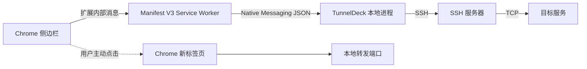

# TunnelDeck Chrome 扩展

TunnelDeck 的 Chrome 扩展是桌面应用的浏览器控制端。扩展负责配置和交互，SSH、TCP 监听、私钥读取以及系统钥匙串访问全部由本机 TunnelDeck 进程完成。

## 架构



- 插件不能直接建立原始 TCP/SSH 连接。
- Native Messaging 仅传输控制命令和状态，不传输隧道业务流量。
- 配置存储与桌面版共用，密码和私钥口令不会写入 Chrome Storage。
- 勾选“记住凭据”后，凭据只写入操作系统钥匙串。
- Native Host manifest 的 `allowed_origins` 只允许指定的 Chrome 扩展 ID。

正式 Chrome Web Store ID 为 `jnfkjehpbkmfnidfcilehhkpbjjinmod`。源码安装器和桌面端的一键注册都默认使用该 ID；自定义 ID 只保留给开发者模式或其他独立商店项目，任何模式都不会写入通配符。

## 安装检测与首次使用

侧边栏打开后会向 `com.tunneldeck.native` 发出 `ping` 请求。握手成功才显示连接管理界面；找不到 Native Host、来源未被允许或本机程序无法启动时，会显示对应的排查提示和当前平台的安装命令。

这项检测不枚举本机应用或文件。它使用 Chrome 官方 Native Messaging 连接结果判断桌面端及注册状态，安装完成后可以点击“重新检测”，从终端或安装指南返回侧边栏时也会自动复检。

正式商店用户直接运行固定版本安装器即可同时安装桌面端并注册商店 ID。桌面端底部也提供“一键注册商店扩展”；开发者 ID 被收在高级入口中，避免普通用户误改正式 ID。

## 支持的操作

- 创建、编辑和删除本地转发配置
- 粘贴并解析安全范围内的 `ssh -L` 命令
- 密码和 SSH 私钥认证
- SSH 主机指纹确认
- 启动、停止、状态推送和断线重连
- 将配置标记为 HTTP 或 HTTPS 网页服务
- 隧道运行后，由用户点击按钮在 Chrome 中打开

“打开网页”不是连接的默认动作。启动、自动重连和 Chrome 启动都不会触发页面跳转。没有标记为网页服务的配置不会显示打开按钮，因此数据库、SSH、邮件等非 HTTP 端口不会被误打开。

## 本地开发

桌面端只提供源码安装方式，不发布未签名桌面二进制。扩展会生成可提交 Chrome Web Store 的审查 ZIP；以下步骤用于开发和手动验证。普通用户安装桌面端可直接参考 [源码安装指南](SOURCE_INSTALL.md)。

构建桌面端前端和扩展：

```bash
npm --prefix frontend ci
npm --prefix frontend run build
npm --prefix extension ci
npm --prefix extension run build
go build -o build/bin/TunnelDeck .
```

在 `chrome://extensions` 中启用开发者模式，选择“加载已解压的扩展程序”，加载：

```text
extension/dist
```

复制页面显示的 32 位扩展 ID。

最简单的注册方式是先启动 TunnelDeck 桌面端，在页面底部的“Chrome 浏览器集成”中粘贴扩展 ID，然后点击“注册 Chrome 服务”。注册完成后重新加载扩展。

下面的脚本方式适合自动化安装、开发环境或桌面界面无法启动的情况。

### macOS

如果使用本地构建产物：

```bash
./scripts/install-native-host.sh \
  --extension-id 你的扩展ID \
  --binary "$PWD/build/bin/TunnelDeck"
```

如果应用已经安装到 `/Applications`：

```bash
./scripts/install-native-host.sh --extension-id 你的扩展ID
```

### Linux

```bash
./scripts/install-native-host.sh \
  --extension-id 你的扩展ID \
  --binary /absolute/path/to/TunnelDeck
```

### Windows

```powershell
.\scripts\install-native-host.ps1 `
  -ExtensionId 你的扩展ID `
  -BinaryPath C:\absolute\path\to\TunnelDeck.exe
```

注册后，在 `chrome://extensions` 中重新加载 TunnelDeck 扩展，再点击工具栏图标打开侧边栏。

## 卸载 Native Host

macOS 或 Linux：

```bash
./scripts/uninstall-native-host.sh
```

Windows：

```powershell
.\scripts\uninstall-native-host.ps1
```

卸载 Native Host 不会删除 TunnelDeck 的隧道配置和系统钥匙串凭据。

## 发布说明

Chrome Web Store 首次创建项目后才会获得正式扩展 ID。发布正式安装包前，需要使用正式 ID 运行注册脚本或将其写入平台安装器。开发阶段的未打包扩展 ID 与商店 ID 可能不同。

本地生成商店 ZIP：

```bash
./scripts/package-chrome-extension.sh
```

产物位于 `artifacts/chrome-web-store/`，ZIP 根目录直接包含 `manifest.json`。推送版本标签后，`Chrome Web Store package` 工作流也会生成同一结构的临时工作流产物。上架文案、隐私声明和审核测试步骤见 [Chrome Web Store 上架资料](CHROME_WEB_STORE_LISTING.md)。

扩展只声明以下权限：

- `nativeMessaging`：连接本机 TunnelDeck。
- `sidePanel`：显示浏览器控制界面。

扩展没有申请浏览历史、所有网站、代理或网页内容读取权限。

## 安全检查

发布前至少执行：

```bash
go test -race ./...
go vet ./...
npm --prefix frontend run build
npm --prefix extension run build
npm --prefix extension audit --audit-level=high
```

同时确认 Native Host manifest 的 `allowed_origins` 是正式扩展 ID，并检查扩展包中不存在密码、私钥、开发者令牌或测试服务器信息。
